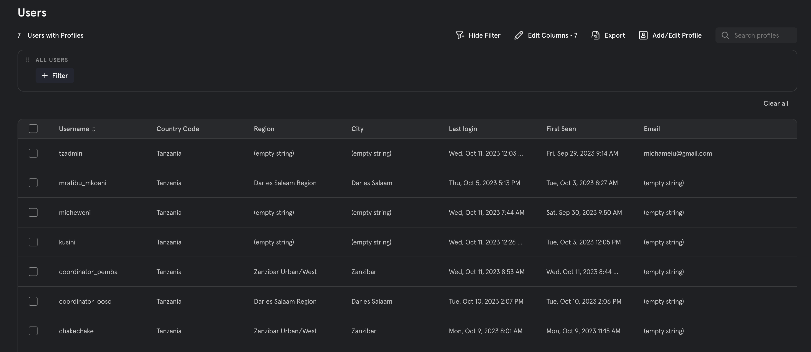

## How to Install Mixpanel on Angular Sites

**Mixpanel's Importance:**  
Mixpanel has revolutionized the way businesses track user interactions and engagement on their platforms. Launched in 2009, it emphasized event-based tracking over the traditional pageviews, enabling more granular insights into user behavior. Its importance lies in its ability to assist businesses in making informed decisions based on real user data.

### Pre-requisites:
- Ensure you have the correct node version running.

### Installation Steps:

1. **Install Mixpanel and its types:**  
   ```bash
   npm install --save mixpanel-browser
   npm install --save @types/mixpanel-browser
   ```

2. **Integration in Angular:**  
   Add the following to your `app.component.ts`:
   ```typescript
   import * as mixpanel from 'mixpanel-browser';

   ngOnInit() {
       mixpanel.init('YOUR PROJECT TOKEN FROM MIXPANEL', { debug: false, ignore_dnt: true, track_pageview: false });

       // debug: false: When set to true, Mixpanel will log detailed debug information to the browser's console. Keeping it as false means that Mixpanel will not output debug logs.

      // ignore_dnt: true: "DNT" stands for "Do Not Track". Some browsers allow users to set a DNT flag, indicating they do not wish to be tracked. If ignore_dnt is set to true, Mixpanel will ignore these flags and continue tracking users who have set the DNT flag in their browser. If it's false, Mixpanel will respect the DNT flag and not track those users.

      // track_pageview: false: By default, Mixpanel tracks page views automatically. If this is set to false, automatic pageview tracking is disabled. This is useful if you want more control over when and how page views are tracked.

       const trackRoute = (route: any) => {
         mixpanel.track('Route Visited', {
           route: route,
         });
       };

       if (environment.production) {
         trackRoute(window.location.pathname); // To only track when the API being used is the one in production
       }
   }
   ```

3. **Obtain a Mixpanel Project Token:**  
   Set up a project on Mixpanel to retrieve your project token.

4. **MixPanel User Profiles**

User Profiles let you enrich events with properties about the users that performed those events. Profiles are optional; we recommend starting with events and only adding Profiles if you need it.

Mixpanel's Users page allows you to filter users and gain a deeper understanding of how they interact with your website or application. By filtering your users into groups called cohorts, you can import these cohorts into other reports and perform analyses on those specific users.


### Identifying first time user logins
#### Impelementing in your Angular Login Button

```typescript
this.auth.login(this.form.value).subscribe(res => {
  this.loaderStatus = false
  const user = res as any; // pass the result to the user object
  if (environment.production) { // check that mixpanel only tracks on the production environment
    mixpanel.identify(user.id); // identify a unique user 
    mixpanel.people.set({
      '$username': user.username, // set custom username proerty to match current username
      '$email': user.email, // set custom email proerty to match current email
      '$last_login': new Date(), // set custom last login date to match current login date
    })
  }

  // this.router.navigate(['/'])

}, err => {
  //this.loaderStatus = false
  //this.loginError = err
})
```
#### Mixpanel Custom Users Page




### References
- [Mixpanel for Angular](https://medium.com/@jeffreyyy/mixpanel-for-angular-e0c0d8c08d3a)
- [Mixpanel Documentation](https://docs.mixpanel.com/docs/getting-started/what-is-mixpanel)
- [Mixpanel Users](https://docs.mixpanel.com/docs/analysis/users)

### Additional Research
- Integration of granular event tracking in addition to route tracking like button clicks (Features should be added to all Sisitech library features)
