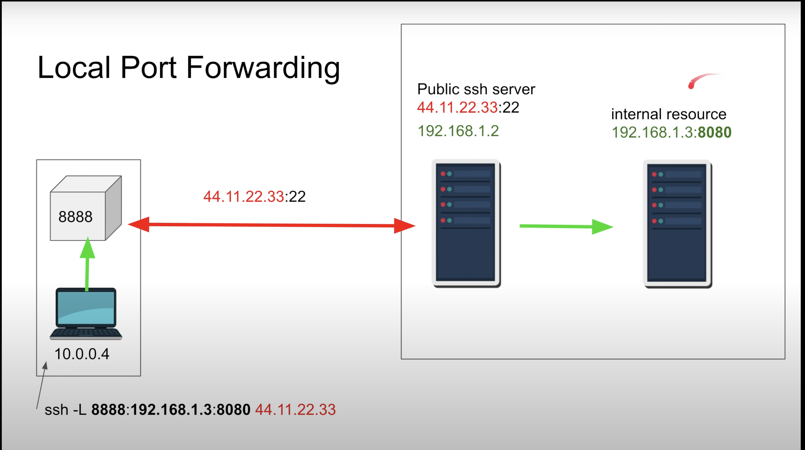
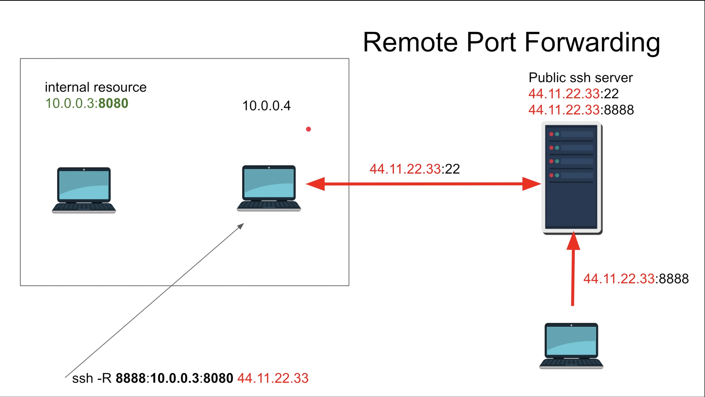

# Port Forwarding

## Local Port Forwading

- Accessing remote resources that you can't access 
- An example is a work database that sits in a company network. Use a device on the same network that is ssh capable and has a public ip.





## Remote Port Forwarding

- Give access to localhost domains assuming it's not possible to forward ports on your home network



### Ensureing the interface is not always localhost

- On the remote server I set in `sshd_config` located at `/etc/ssh/sshd_config`

```config title="/etc/ssh/sshd_config"

GatewayPorts clientspecified
```

Then I changed the arguments on the client like this:

- `ssh root@X.X.X.X -R 10.10.10.1:443:127.0.0.1:443`

Now it works as expected, SSH binds to port `443` on interface `10.10.10.1` and forwards all traffic over the tunnel to `localhost:443` 