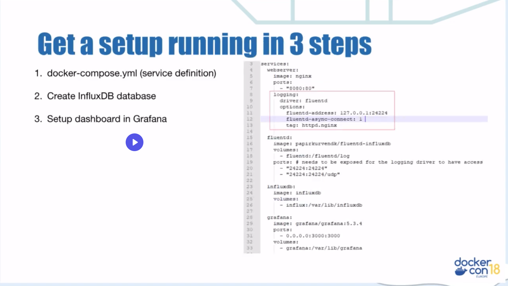

# Docker Compose


## Docker  Commands
Prefix `docker ` 

|Name|Options|Description|
|:-|:-|:-|
|`images`||List the available images|
|`ps`||Check the running containers|
|`image`|`rm img1 img2`|Remove images|
|`image`|`ls -q`|list images id alone. eg `docker image rm -f $(docker image ls -q)`|
|`container`|`ls -q`|List containers `docker container rm -f $(docker image ls -aq)`|
|`exec`|`-it -u root 8c6 sh`|`-it` is the interactive mode. `-u` Login as this user. `8c6` is the id of the container.(First three characters). `sh` is the terminal for the session|

## Docker Compose  Commands

Prefix `docker-compose` or `docker compose` 

**NOTE**: *`docker-compose` command is similar to `docker` command but most commands will impact all the containers for serivices defind.*

|Name|Options|Description|
|:-|:-|:-| 
|`build`|`--no-cache`|Prevent caching of images|
|`config`||Check validity of the file|
|`up`|`--build`|Force a rebuild when starting the application|
|`up`|`-d`|Detach mode. start in the background |
|`up`|`--scale database=4 -d`|Detach mode. start in the background |
|`down`||Stops and removes the containers|
m 


**NOTE**:*All the images built are prefixed the name of the folder `docker-compose.yml` is in*

## Creating a compose file

### Version
- Depends on the docker engine supported
- This is not required and can be left out (Not supported by all versions of docker-compose)
 

```yml
version: "3.8"
...
```

### Services
- Services you need for your infrastructure
- Could be named anything

#### Properties
- `ports` - To expose port
- `build` - To Build from a folder with a Dockerfile
- `depends_on` - to list the services that must be created before it's created (`v2` and above)


```yml
version: "3.8"
services:
  frontend:
    build: ./frontend # Location with a Dockerfile
    ports:
      - 3000:3000 # host:container
    environment:
      DB_URL: mongodb://database_s/vidly # database_s refers to the service. Docker networking maps the database_s to the ip of that service

  backend:
    build: ./backend
    ports:
      - 3001:3000
  database_s:
    image: mondo:4.0-xenial
    ports:
      - 27000:27017
    
    volumes:
      - vidly: /data/db # host: container. This is where mongodb stores is files at

Volumes:
  ...
...
```

### Volumes

```yml
version: "3.8"
services:
  ...
Volumes:
  vidly: 
...
```


## Starting the application

`docker compose up `


## Security
-  ggshield to scan images for secret leaks


- Pre commit hooks to scan using ggshield
- `https://www.vaultproject.io/`


## Logs 

- Collector `fluentd` - connects to docker log driver sends to `influxdb`
- Storage `influxdb` (Time based database)
- Visualizer `Grafana`
- Web server `nginx`


